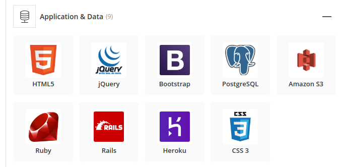
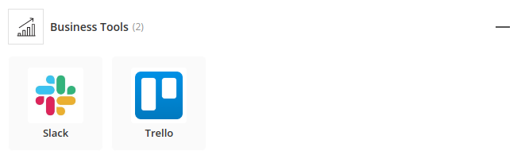
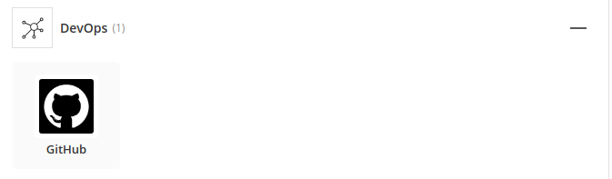
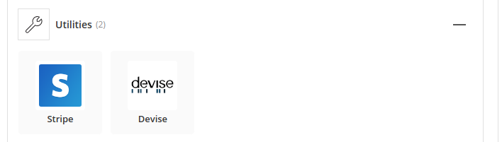

<!-- # README

What is the need (i.e. challenge) that you will be addressing in your project?
Identify the problem you’re trying to solve by building this particular marketplace App? Why is it a problem that needs solving?
Describe the project will you be conducting and how. your App will address the needs.
Describe the network infrastructure the App may be based on.
Identify and describe the software to be used in your App.
Identify the database to be used in your App and provide a justification for your choice.
Identify and describe the production database setup (i.e. postgres instance).
Describe the architecture of your App.
Explain the different high-level components (abstractions) in your App.
Detail any third party services that your App will use.
Describe (in general terms) the data structure of marketplace apps that are similar to your own (e.g. eBay, Airbnb).
Discuss the database relations to be implemented.
Describe your project’s models in terms of the relationships (active record associations) they have with each other.
Provide your database schema design.
Provide User stories for your App.
Provide Wireframes for your App.
Describe the way tasks are allocated and tracked in your project.
Discuss how Agile methodology is being implemented in your project.
Provide an overview and description of your Source control process.
Provide an overview and description of your Testing process.
Discuss and analyse requirements related to information system security.
Discuss methods you will use to protect information and data.
Research what your legal obligations are in relation to handling user data.

This README would normally document whatever steps are necessary to get the
application up and running.

Things you may want to cover:

* Ruby version

* System dependencies

* Configuration

* Database creation

* Database initialization

* How to run the test suite

* Services (job queues, cache servers, search engines, etc.)

* Deployment instructions

* ... -->

## Entertrainer -- Rails Application (Ari Freidgut, Sam Conway)

### Links
* [Github Repo](https://github.com/fxbip/rails_assessment "Github")

### Description
#### Problem definiton / purpose
We wanted to create and application
#### Functionality / features
#### Screenshots

### Tech Stack

### Design documentation
#### Design process
#### User Stories
#### Workflow Diagram
#### Wireframes
#### ERD

### Planning Process
#### Project plan & timeline
#### Trello Screenshots

### Short Answer Questions

#### What is the need (i.e. challenge) that you will be addressing in your project?

We are addressing the lack of applications/web applications available for people to find trainers/mentors in the Performing arts fields. We wanted to create a Web Application that gave users an easy to use app to find a trainer in their field of choice, plus make it an enjoyable and effecient process.   

#### Identify the problem you’re trying to solve by building this particular marketplace App? Why is it a problem that needs solving?

#### Describe the project will you be conducting and how. your App will address the needs.

Our Entrertrainer web application will use an advanced search on the landing page to search for a skill(in the Peforming Arts) and a location of a trainer with the chosen skill/s. This will send you to another page with results of the given parameters, the user can then search by some other feilds e.g. rate per hour and/or review rating, to help them make a desicion on the best trainer for them. Clicking on a single trainer will allow the user to see some more detailed information on the trainer and some written reviews from past users you have used the particualar trainer before. Booking the trainer is an easy process, we will have a book button on the trainers page from the listing which is their hourly rate, once clicking the page there will be a another page that explains what the user is booking as a confirmation.

We will be using stripe as our payment system for a quick and secure payment process. Once the payment is confirmed the trainer will get in touch with the buyer within the week. Users can see the bookings they made on their profile page which will show infomration of the booking e.g. date booked, rate, Name of the trainer, contact information. If the trainee wants to become a trainer, no problems! they can click on the become a trainer tab and fill out some further information to become a trainer.

#### Describe the network infrastructure the App may be based on.
#### Identify and describe the software to be used in your App.
#### Github
Using it as our Repository hosting service. A great tool with lots of integration options, an easy way to work on the same application without causing conflicts, an easy tool to get our application our to the public, and due to Gut being open source, allows other to fork our application and make changes that could potentially improve the funcionality of our app if we so choose to accept the changes.
#### Trello
Using it as our Project Management tool. An easy tool to keep track of tasks, to delegate work between the developers working on the application, minimizes confusion on who is doing what to reduce possible conflicts
#### Identify the database to be used in your App and provide a justification for your choice.
#### Identify and describe the production database setup (i.e. postgres instance).
#### Describe the architecture of your App.
#### Explain the different high-level components (abstractions) in your App.
#### Detail any third party services that your App will use.
#### Describe (in general terms) the data structure of marketplace apps that are similar to your own (e.g. eBay, Airbnb).
#### Discuss the database relations to be implemented.
#### Describe your project’s models in terms of the relationships (active record associations) they have with each other.
#### Provide your database schema design.
#### Provide User stories for your App.
#### Provide Wireframes for your App.
#### Describe the way tasks are allocated and tracked in your project.
#### Discuss how Agile methodology is being implemented in your project.
#### Provide an overview and description of your Source control process.
#### Provide an overview and description of your Testing process.
#### Discuss and analyse requirements related to information system security.
#### Discuss methods you will use to protect information and data.
#### Research what your legal obligations are in relation to handling user data.