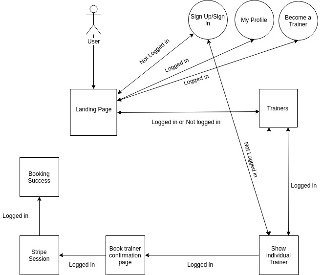
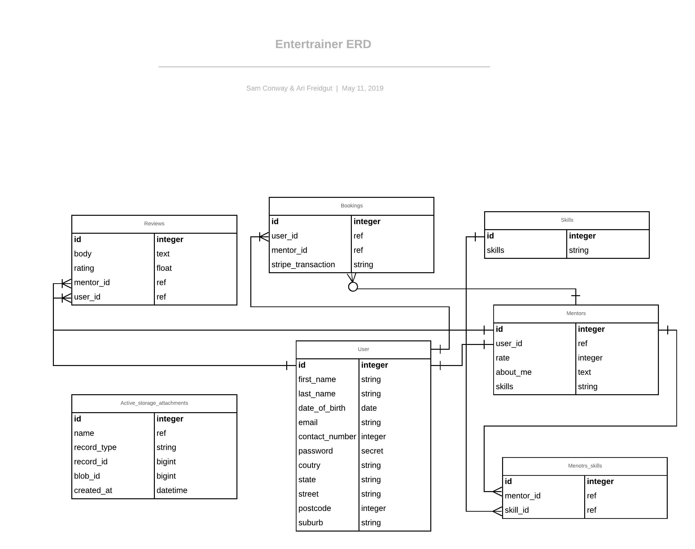

## Entertrainer -- Rails Application (Ari Freidgut, Sam Conway)

### Links:
 * [Entertrainer (Rails Application)](https://fierce-everglades-61246.herokuapp.com/ "Rails App")
 * [Github Repo](https://github.com/fxbip/rails_assessment "Github")

<!-- ### Table of Contents:
* [Description](###Description:)
    * [Problem definiton/purpose](###Problem)
    * [Funcitonality / Features](###Description:)
    * [Description](###Description:)
 -->

### Description:
#### Problem definiton / purpose
We wanted to remedy the lack of Performing Arts application available on the web. For a user it is very difficult to find an application that has a generalized overview of performing arts that covers many different fields within it. Creating an app that will be a platform that will cater to all sorts of topics, from dancing, to guitar, to ventriloquism. It's all there.
#### Functionality / features
* Easy to use search system
* Easy Sign up
* Become a trainer with ease!
* Learn any type of Performing arts topic!
* Review system to find the most reliable and high quality trainers
* Easily manage your bookings as a Mentor!
* Edit your detials with a few clicks
* Become a part of a PA community within your City!

#### Screenshots

### Tech Stack

### Design documentation
#### Design process
#### User Stories
* User:
    * I want to be able to see and view a profile of a trainer to see more detailed information on them.
* User:
    * I want to easily be able to sign up with an easy to follow form and instructions.
* Trainer:
    * I want to easily see who booked me and when, so I can keep track with who has booked me to keep organised
* User:
    * I want to be able to leave comments/reviews on past trainers I have used to help protray their reputation and quality as a trainer.
* Trainer:
    * I want to easily be able to change my details in regards to my training without hassle.
#### Workflow Diagram

#### Wireframes
#### ERD

### Planning Process
#### Project plan & timeline
#### Trello Screenshots

### Short Answer Questions

#### What is the need (i.e. challenge) that you will be addressing in your project?

The challenge we took on was to build a two sided marketplace using Ruby on Rails (RoR). We wanted to build a marketplace for the Performing Arts community, due to lack of other platforms offering such services. We wanted to create an application that will serve as a platform for ALL fields within the Performing Arts, instead of a niche. It will be a one stop shop for anything performing arts related, based around finding trainers to improve and learn about any Performing Arts field.    

#### Identify the problem you’re trying to solve by building this particular marketplace App? Why is it a problem that needs solving?

There is a major shortage of Performing Arts marketplaces, in our research ,we found niche web apps that could teach one or two different skills, if you wanted another skill, you had to look elsewhere. We are building an application that will have around 30 different fields within the Performing Arts! With room for constant expansion. We want it to become a platform for all PA people to come and share their expertise, or learn about something new! The one stop shop for anything PA (Performing Arts) related.

#### Describe the project will you be conducting and how. your App will address the needs.

Our Entrertrainer web applicaion will serve as a one stop shop for all PA trainers and lovers alike to share skills. Users and trainers will be able to book a trainer, by paying an hourly fee given by the trainer. Whilst choosing a trainer, you can see some information about them, their reviews to show their reputation and quality of teaching, and of course their location. Users can become trainers very easily by filling out some extra information, making it an easy to use two sided marketplace.

#### Describe the network infrastructure the App may be based on.

Rails runs on puma on our localhost. Puma provides a very fast and concurrent HTTP 1.1 server for Ruby web applications. It is designed for running Rack apps only. When we push it into production, it will run on Heroku, which is a cloud platform that allows you to still develop, monitor and scale your application.

#### Identify and describe the software to be used in your App.

#### Rails
Rails is our application framework, It is a great and time efficient tool due to its many pre made  boilerplate code. It follows the MVC convention (Model,View,Controller). Consistencey is another great thing about Rails, as it follows a convention for storage and file naming to make it extremely readable. It’s an extremely high quality framework which immensly promotes bug free development from syntax to tests. 

It’s quite scalable which is great if the application starts to boom. Last but not least its very secure, it has some great built-in security features, It can also be made even more secure by following some very well detailed documentation.

#### Github
Github is a Repository hosting service. A great tool with lots of integration options, an easy way to work on the same application without causing conflicts, an easy tool to get our application out to the public, and due to Gut being open source, allows others to fork our application and make changes that could potentially improve the funcionality of our app if we so choose to accept the changes.

#### Trello

Trello is a web based list-making application used mainly in project management. It’s a tool used collaboration, which organizes your projects into boards. You can easily see what’s being worked on, who is doing what, and where something is in a process to allow for a smoother experience in the development phase.

#### Stripe

We wanted an easy to implement and easy to use complete payment system. Stripe was our answer.  Stripe has developer first mindset which makes it the great choice for us. Secure interaction with Stripe servers keeps sensitive data safe which gives us ease of mind when working on our payments.

####  Pin interest

Pin Interest is a web based social media network, which allows users to share images associated with  a certain topic, product, service etc. and a nice platform to find new interests by searching and looking at other images other have posted. It’s a great tool for inspiration for front-end design decisions on a web application such as colour schemes and the feel of the application.  

#### Heroku

Herkou is a cloud platform that allows you to deliver, monitor  and scale applications. Its one of the quickest ways to go from an idea to an URL, skipping many complex infastrutcure issues. Herkou has a massive focus on applications and tries to deliver a platform that allows developers to spend more time on developing and delpoying apps that immediately have an impact on the community. 

#### AWS (Amazon Web Service)

AWS is a cloud services platform offering compute power which is virtual servers called intsances, storage which is scalable object storage for data backup, archivale and anaylitics. content delivery and many other services. It’s a service in built in the form of building blocks, where each building block are designed to work with each other, which the required result is to have an application that is sophisticated and highly scalable.  
 

#### Identify the database to be used in your App and provide a justification for your choice.

We used postgreSQL, It’s a completely open source  project, which means we can use the standard version of postgreSQL for absolute free, and be able to use the all the benefits of the it with complete freedom. It has high SQL compliance, its supports 160 out of 179 features of a full core SQL. It has good intergration with other tools due to its wide array of compatability with lots of programming languages and platforms. Which means if we ever need to migrate our DB to another OS or intergrate to another tool, it will be a much easier process.

#### Identify and describe the production database setup (i.e. postgres instance).

Heroku creates its own collection of the database on your local computer, you then need to run a rake migrate command to migrate onto Heroku. Next you have to rake seed the migrated database, to fill it with the the data in the seeds file. 
 

#### Describe the architecture of your App.

Our web application uses the MVC architecture  convention, which stands for Model, View, Controller. Our Models holds all of our data, from user details, mentor details, bookings, you name it. Our views is used soley for the displaying of the data, this will be everything that the user interacts with (UI, User Interface). Controllers work sort of like a middle man between the other two. It can update a model by manipulating data and then can modify what will be displayed in the view to the user. 

#### Explain the different high-level components (abstractions) in your App.

Our Entertrainer Application uses the follwing models (user, mentor, review, booking, skill,). When you first sign up, you sign up as a User, once you sign up as a User there is an option to become a trainer, once you sign up as a trainer, that data will be stored within the Mentor model, which holds a User ID. An User or a Mentor can book for training.

When you booking for training, and have confirmed the booking through Stripe, that information will be pushed into our Booking Model, which will store the User Id of the the person making the booking, and the Mentor Id of the person being booked. You can leave a review on a trainer inside their show page. This is stored in a very similar fashion to how a booking works, User Id of the user making the review and the Mentor Id of the one being reviewed.   

#### Detail any third party services that your App will use.

#### Bootstrap (Using version 4)

Boostrap is a free open source CSS (based on flexbox grid) framework, used for mobile first responsive design, it contains javascript and CSS based design templates from typograhpy to naivgation and many more.   

#### Devise

Devise is a mult-client and secure token based Authentication system for Rails. It works by refreshing the tokens on each request, and then expires them after a short time, which leaves the application secure.

#### Kaminari

Kaminari is a gem that allows a developer to create pagmantation with ease. A great front-end development tool to make quick responsvie and beautiful websites and applications.

#### Ultrahook

Ultrahook is a great tool to receive webhooks, It gives you persistent public endpoints in a private namespace, and will work anywhere with a public HTTP connection. How ultrahook is that it receives HTTP POST requests at it's public endpoint. It then serializes the requests into a custom format and sends them to a connected client, where it's deserialized and delivered to a private endpoint via curl. 

#### Describe (in general terms) the data structure of marketplace apps that are similar to your own (e.g. eBay, Airbnb).

CouchSurfing is a Web Application with similar data structure to our application. It allows users to sign up and become a host, like Entertrainer signing up and become a trainer. You can host couches which will become listed on their Application for users to see, which is similar to trainers being listed once they become trainers on our site. 

                                          
#### Discuss the database relations to be implemented.

Our application has exmaples of different types of relations. Our users and mentors has a One-to-One relationship. A User can become a Mentor, a User can only become one Mentor, and the Mentor is linked to the User that created it. A Mentor can have many bookings so our Mentor to Booking table has a One-to-Many relationship, a Mentor has many bookings. This is similar for reviews, the Mentor can have many reviews, another One-to-Many relationship. 

Our skills table is linked to a join table with Mentors, the table is called mentor_skills. A Mentor can have many skills, there for we have One-to-Many relationship here. Bookings has a One-to-Many relationship with both users and mentors, the both can make multiple bookings on different Mentors.  

#### Describe your project’s models in terms of the relationships (active record associations) they have with each other.

Reviews, mentors, bookings, reviews all belong to the Users. This makes it easy to display any information regarding those models, Mentors and Skills models are in a joint table as Mentors could have and teach a wide vairety of skills. 

Bookings belong to Users and Mentors, so we can easily display who has been booked by, and who has been booked.

#### Provide your database schema design.

#### Provide User stories for your App.

User:
I want to be able to see and view a profile of a trainer to see more detailed information on them.
User:
I want to easily be able to sign up with an easy to follow form and instructions.
Trainer:
I want to easily see who booked me and when, so I can keep track with who has booked me to keep organised
User:
I want to be able to leave comments/reviews on past trainers I have used to help protray their reputation and quality as a trainer.
Trainer:
I want to easily be able to change my details in regards to my training without hassle.

#### Provide Wireframes for your App.
Done
#### Describe the way tasks are allocated and tracked in your project.

We split our work using the MVC convention. Someone would be allocated a Model, Controller or a View to complete. We had a To Do, Working On, and a completed column within Trello to keep track on the progress of the task. While in Working On, the dev working on the task would update the card to say where about it’s at within its completing time, before finally getting pushed to the Completed column. We would also near the end of the day go over our Trello and pick tasks to do for the following day from the board, and complete in the following manner explained above. 

#### Discuss how Agile methodology is being implemented in your project.

We discussed the day before what we were going to complete the following and complete them in sprints. Trello helped to organise these sprints for us. We used a lot of face to face communication as it is the best way to transfer infomration from team member to team member. 

Everything we did in the creation of the app was based around the users/clients needs, how to make their experience easier, how to adapt and develop to new ideas related to the user. Trying to get things done on a consistent basis for constant progression and development of the application.  

#### Provide an overview and description of your Source control process.

Git was our Source control platform, We created a Dev branch that would be the sole branch that would push to the master. Off the Dev branch, we created our own individual branches where we did our assigned works. This way we would never casuse conflicts inside the Master branch, and never cause conflicts withing our own development enviroments. 

#### Provide an overview and description of your Testing process.

We created some automated tests using Cypress. These tests were created by testing important funcitonality of the application. Tests such as, sign in, sign up, booking a trainer, sign out, edit information and more. Anything that are vital to the functionality of the User to use our application.  

#### Discuss and analyse requirements related to information system security.

CSRF (Cross Site Request Forgery) is a type of threat/attack, that forces an end user to execute unwanted actions on a web application in which they're currently authenticated. CSRF attacks specifically target state-changing requests, not theft of data, since the attacker has no way to see the response to the forged request. 

As mentioned previously, Devise with its authentication token system, helps to combat this type of attack, due to expiring tokens that cant be access buy an attacker to use for long term authentication.  

#### Discuss methods you will use to protect information and data.

We are using Stripe do be responsible for users billing information, so we don’t have to have the trouble of holding that sensitive information. We have devise authentication and also creating a cookie which creates a Session, which comes with an ID of 32 character random hex string. Rails also has a master key which is the key to your encryption key. Without the master key, no one can read the credentials in the credentials.yml file. 

#### Research what your legal obligations are in relation to handling user data.

The Privacy Act 1988 is an Australian law which regulates the management, storing, access and correction of personal information about individuals.  The Privacy Act includes thirteen Australian Privacy Principles (APPs) that businesses covered by the Privacy Act will need to comply with. User data that is considered sensetive are such things as person's name and address, medical records, bank account details, photos, videos and even information about what an individual likes, their opinions and where they work.

